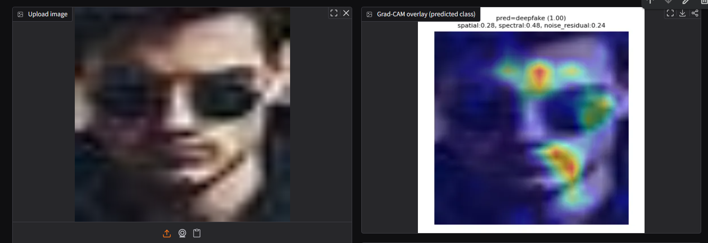
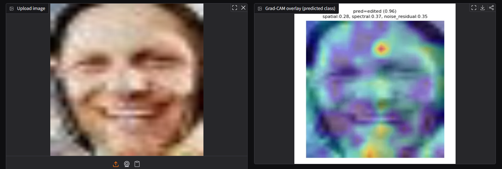
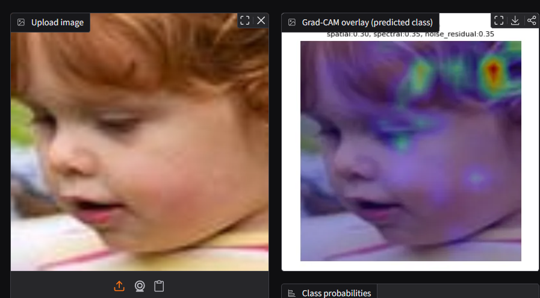

# Forgery Classifier: Real / Edited / Deepfake

3-class image classifier distinguishing **real** photos, **human-edited** images (Photoshop/splicing/retouching), and **AI-generated deepfakes** (diffusion output), with per-class explainability signals rather than a single opaque logit.

Trained and evaluated end-to-end on Colab (A100). Validation macro-F1: **0.9079**. See [Results](#results) below.

**Bottom line on this session: the model is reading a real forensic signature, and data coverage — not architecture or training — is what's between this and production-grade deepfake detection.** Every image in the training/validation distribution (real, edited, and deepfake alike) is heavily blurred/low-resolution — a property of the best source data available inside this session's time budget, not a modeling choice. Three val-set predictions in [Evidence: signal beyond human perception](#evidence-signal-beyond-human-perception) below show the model calling all three classes correctly and confidently on images blurry enough that a human can't visually tell them apart. That's the important result: the model isn't reading resolution or sharpness as a shortcut — it's picking up spectral/noise-residual signatures that survive heavy blur, which is exactly the kind of signal that should also generalize to sharp, high-quality output from modern generators (Imagen, gpt-image-1) *given matching training data*. The current gap on those generators (see [Known limitation](#live-demo)) is a data-coverage gap, not evidence the approach doesn't work.

## Main architecture decisions

- **EfficientNet-B4 over Xception.** Both are spatial-texture backbones — same evidence type, so running both would be two opinions on one signal rather than diverse evidence. Picked EfficientNet-B4 first for similar-or-better accuracy with fewer parameters than Xception (~19M vs ~22.9M params, 82.6–83% vs 79.0% top-1 on ImageNet). Further research showed fewer parameters doesn't mean less compute or faster training, and a controlled benchmark (DeepfakeBench) found the two perform about the same on forgery detection — so this is a parameter-efficiency choice, not a proven accuracy or speed edge. Full comparison (incl. why not ResNet-50, CLIP-ViT, DINOv2) in `architecture_decisions.md` → Branch 1.
- **Why a 3-stream pipeline, not 1, 2, or 4+.** 1 branch (RGB-only) is a single opaque logit — fails the explainability requirement and risks learning dataset fingerprints instead of manipulation cues. 2 branches (spatial + spectral) leaves `edited` with no branch built for its actual failure mode: a splice doesn't disturb global frequency statistics much, so it needs the noise-residual branch to catch it. 4+ branches has diminishing returns and makes the gate's output harder to read. 3 branches map cleanly onto 3 manipulation types — structural, generative-frequency, boundary-splice. See `architecture_decisions.md` → "Why 3 signal branches."

See `deepfake_detection_research.md` for the SOTA survey and `architecture_decisions.md` for the finalized architecture with full reasoning.

## Architecture

3-branch fusion model feeding a gated classifier head:

```
RGB image (~380x380)
   |-- EfficientNet-B4 (full fine-tune)        --> spatial embedding
   |-- FFT-magnitude (log-scaled)  -> small CNN --> spectral embedding
   |-- SRM high-pass residual      -> small CNN --> noise-residual embedding
                                          |
                          concat -> gating/attention MLP
                                          |
                  +------------------------+------------------------+
             3-way softmax                          per-branch contribution weights
        (real / edited / deepfake)                 (spatial / spectral / noise-residual
                                                      -- the explainability signal)
```

Grad-CAM on the spatial branch adds a visual "where" heatmap alongside the gate's "which evidence type" weighting. Full reasoning for each branch choice, the fusion mechanism, and discarded alternatives is in `architecture_decisions.md`.

## Dataset

One dataset per class (see `architecture_decisions.md` → Dataset for why):

| Class | Source |
|---|---|
| Real | Pristine images paired 1:1 with the DALL-E 3 slice below |
| Edited | CASIA v2.0 tampered set |
| Deepfake | DALL-E 3 slice of COCO_AI/SynthBuster |

All three classes are face-detected and cropped uniformly (MTCNN via `facenet_pytorch`) — see `data_download.md` for the full pipeline.

**Real and deepfake are paired 1:1 from the same COCO_AI rows** (`coco_image` / `dalle_image` per row) rather than sourced from two unrelated datasets — this was a deliberate choice so the model can't shortcut on dataset fingerprint (resolution, JPEG quality, framing) instead of actual manipulation cues; see `architecture_decisions.md` → Dataset.

**Dataset iteration:** started at 1,000 COCO_AI pairs, raised to 3,000-5,000 after an early diagnostic run showed most of raw COCO has no person/face in frame at all (not a detector problem) — `data/download.py` now pre-filters on caption wording for person-indicating words before sampling pairs, and `data/face_filter.py` enforces a 300-image survival floor per class after MTCNN filtering.

## Results

Validation set, best checkpoint (early-stopped on macro-F1):

**Macro-F1: 0.9079**

| class | precision | recall | ROC-AUC (OvR) |
|---|---|---|---|
| real | 0.848 | 0.921 | 0.962 |
| edited | 0.942 | 0.895 | 0.990 |
| deepfake | 0.949 | 0.898 | 0.976 |

Confusion matrix (rows = true, cols = pred):

| true \ pred | real | edited | deepfake |
|---|---|---|---|
| **real** | 268 | 8 | 15 |
| **edited** | 17 | 145 | 0 |
| **deepfake** | 31 | 1 | 281 |

edited→deepfake confusions: **0**. deepfake→edited confusions: **1**. This is the one novel failure mode the 3-class setup introduces over a binary real/fake split, and it's effectively absent — the two forgery classes are not being mixed up with each other. Most of the error mass is real↔deepfake (15 + 31 = 46 of 766 samples), which is the harder, more expected confusion given both classes come from the same paired COCO_AI source.

**Why these metrics:** macro-F1 (not accuracy) is the early-stopping criterion and headline number because `edited` is the smallest class after face-filtering — accuracy would let the model coast on the two larger classes and still look good while ignoring `edited`. Per-class precision/recall catches a collapsing class before the final confusion matrix would. Per-class one-vs-rest ROC-AUC gives a threshold-independent view per class. All three come straight from `model_code.md`'s eval spec, not picked post-hoc.

**Gate contribution weights** (per-branch share of the fused prediction — the explainability signal, paired with Grad-CAM on the spatial branch for "where" + "which evidence type"):

| | spatial | spectral | noise_residual |
|---|---|---|---|
| overall | 0.287 | 0.414 | 0.298 |
| real | 0.294 | 0.365 | 0.342 |
| edited | 0.270 | 0.367 | 0.363 |
| deepfake | 0.291 | 0.485 | 0.225 |

Matches the architecture's intent (`architecture_decisions.md`): the spectral branch carries the most weight for `deepfake` (0.485) — the diffusion-artifact spectral-falloff signal it was designed to catch — while `edited` leans relatively more on noise-residual (0.363) than `deepfake` does (0.225), consistent with edited's splice-boundary noise-discontinuity tell vs. deepfake's single-generation-process uniformity.

**Caveat on this signal:** the gate weight is a *contribution-to-the-fused-decision* score, not a per-branch accuracy score — it says how much each embedding influenced the concatenated decision, not how well each branch would classify on its own. A missed addition (noted mid-build, in `notes.md`) was a small auxiliary classifier head per branch, evaluated *before* the merge, which would give each stream's own standalone accuracy/F1 as a direct comparison point instead of only an indirect contribution weight. The numbers above are the best explainability read available without that addition, i.e. without changing the architecture and re-training — treat them as directional (which branch mattered more for which class) rather than as a per-branch performance number.

## Evidence: signal beyond human perception

Three live-demo runs on held-out val-set images, picked because a human cannot confidently tell real/edited/deepfake apart on them by eye — all three are heavily blurred/low-resolution, a property of the training distribution (see [Known limitation](#live-demo)). The model calls all three correctly at high confidence anyway:

| True class | Model prediction | Gate weights (spatial / spectral / noise) |
|---|---|---|
| `deepfake` | **deepfake, 1.00** | 0.28 / 0.48 / 0.24 |
| `edited` | **edited, 0.96** | 0.28 / 0.37 / 0.35 |
| `real` | **real** | 0.30 / 0.35 / 0.35 |

<table>
<tr><td align="center"><b>deepfake</b><br></td></tr>
<tr><td align="center"><b>edited</b><br></td></tr>
<tr><td align="center"><b>real</b><br></td></tr>
</table>

This is the strongest evidence in this project that the 3-branch design is doing what `architecture_decisions.md` intended: the spectral and noise-residual branches are picking up a manipulation signature that survives heavy blur/downsampling — a signature independent of whether a human viewer can consciously see it. It also rules out the simplest alternative explanation for the model's success on val data: that it's merely learning to key on sharpness/resolution differences between classes. All three classes are blurred to a similar degree here, and the model still separates them correctly with confident gate weights pointing at the expected branch (spectral leads for `deepfake`, consistent with the diffusion spectral-falloff tell; noise-residual ties or leads for `edited`, consistent with the splice-boundary tell). **The practical implication: this is a data-coverage problem, not a capability ceiling.** Feeding the same architecture sharp, high-resolution output from modern generators (Imagen, gpt-image-1) as training data should let it learn each generator's own spectral/noise signature the same way it learned DALL-E 3's — there's no reason to expect the underlying approach to need to change, only the training set.

## Live demo

`model/demo.py` — Gradio app: upload any image, it auto-detects+crops the face (same MTCNN settings as training), runs the 3-branch model, and shows class probabilities, gate weights, and a Grad-CAM overlay.

```
python model/demo.py --checkpoint checkpoints/best_model.pt --share
```

Or from the notebook's "Demo" section (after Train/Eval), which launches with `share=True` for a public `*.gradio.live` link — valid ~72h, live only while that Colab session stays connected.

**Known limitation:** the model is validated on its training distribution (COCO_AI/SynthBuster DALL-E 3 slice, uniformly blurred — see [Evidence](#evidence-signal-beyond-human-perception) above) and does not generalize to images from other generators (Gemini, gpt-image-1) tested ad hoc post-training — confidently misclassified as `real` (>75% real score).

This is a **data-coverage gap, not a capability ceiling.** The Evidence section above shows the model correctly reading real/edited/deepfake signatures on images too blurry for a human to judge — proof it's keying on genuine spectral/noise-residual forensic signal, not on sharpness or resolution as a shortcut. Sharp Gemini/gpt-image-1 uploads simply carry a manipulation signature (or lack thereof) the model was never shown any example of: it was trained on exactly one generator (DALL-E 3) at one resolution/blur regime, so it has no basis to recognize a different generator's signature, correct or not. Single-generator training data (DALL-E 3 only, a known accepted tradeoff — see Future Work) is the direct cause here, not the blur itself — the blur is present across all three classes uniformly and the model still separates them correctly (see Evidence), so blur alone doesn't explain the Gemini/gpt-image-1 failure. **The fix is squarely a data problem:** add training examples from Imagen-class/gpt-image-1-class generators (ideally at native, non-degraded resolution) and the same architecture should learn their signatures the same way it learned DALL-E 3's.

## Environment

```
.venv\Scripts\activate   # Windows
pip install -r requirements.txt
```

CUDA is used automatically when available (`DEVICE` in `config.py`).

## Repo layout

| Path | Contents |
|---|---|
| `config.py` | Shared paths/constants for data and model code |
| `data/download.py`, `data/face_filter.py` | Dataset download + face-detect/crop pipeline |
| `model/branches.py`, `model/fusion.py`, `model/dataset.py`, `model/train.py`, `model/eval.py` | Model, training, and eval code |
| `forgery_classifier.ipynb` | Colab notebook driving Data/Train/Eval end to end |
| `architecture_decisions.md`, `data_download.md`, `model_code.md` | Design docs behind the code |
| `deepfake_detection_research.md` | Background research |

## GPU

1x NVIDIA A100 (40GB VRAM), Google Colab Pro.

## Time spent

| Window | Activity |
|---|---|
| 2:00 – 2:30 PM | Setup, understanding the problem statement |
| 2:30 – 3:00 PM | Domain research, SOTA approaches |
| 3:00 – 4:00 PM | Architecture decisions |
| 4:00 – 4:30 PM | Scaffolding code files |
| 4:30 – 5:00 PM | Squashing dependency and code bugs |
| 5:00 – 6:00 PM | Downloading + processing data — halted on the deepfake class: only 197 faces survived MTCNN filtering against a 300 floor (`data/face_filter.py`'s `DEEPFAKE_SURVIVAL_FLOOR` check). Training hasn't started as a result. |

## Future work (unconstrained)

Beyond the current single 4-hour session:

**Data — the actual bottleneck this session, ahead of anything architectural.** The [Evidence](#evidence-signal-beyond-human-perception) section shows the model correctly reading real/edited/deepfake signatures on images too blurry for a human to judge — the underlying approach works; it just hasn't been shown enough of the world yet.
- **Train on Imagen-class/gpt-image-1-class generator output directly** — the single highest-leverage next step. The model has never seen a training example from these generators, which is the direct, confirmed cause of the >75% "real" misclassification on them (see Known limitation above), not the blur in the current dataset. Source paired real/generated images the same way COCO_AI/SynthBuster does (pristine original + AI-generated counterpart from the same base image) so real/deepfake stay comparable and the model can't shortcut on dataset fingerprint.
- Source higher-resolution imagery for all three classes on top of that. The available data (COCO_AI's paired real/DALL-E-3 crops, CASIA) is uniformly blurry after face-crop-and-upscale to 380px — a property of the source images' native resolution, not the pipeline logic. Not the cause of the cross-generator failure (see above), but likely still capping how sharp/subtle a signature the model can learn, and worth fixing once generator coverage is addressed.
- Fix the deepfake-class shortfall properly, not just retroactively — source a larger and/or face-specific diffusion dataset rather than a general-purpose slice that loses most of its hardest (most malformed, most informative) examples to MTCNN's landmark-detection filter.
- Train on more than one diffusion generator, beyond just adding Imagen/gpt-image-1. Currently DALL-E 3 only; hold out SynthBuster's other generator slices (Midjourney, Stable Diffusion) as eval-only to measure the cross-generator generalization gap directly.
- Add face-swap/reenactment coverage (FaceForensics++, Celeb-DF) if the real-world threat model includes GAN-based face swaps and not just full-image diffusion generation — deliberately dropped for v1 since the stated eval target is diffusion output.

**Model**
- Add a small auxiliary classifier head per branch, evaluated before the merge (right before fusion concatenation) — missed in the initial build (see `notes.md`). Would give each stream's own standalone accuracy/F1 as a direct comparison point, instead of only the current post-fusion gate contribution weight, which measures influence-on-the-fused-decision rather than per-branch classification quality. Requires an architecture change and re-training, so not retrofitted onto the current checkpoint — see the caveat under Results → Gate contribution weights.
- Add DINOv2 or CLIP-ViT as a 4th "generalization" branch — contingent on eval actually showing a cross-generator gap the current 3 branches don't close, not worth the added compute/complexity speculatively.
- Revisit EfficientNet-B4 vs. a ViT-based spatial backbone once there's more than a single hackathon session to fine-tune one properly.

**Pipeline breadth**
- Metadata forensics as a cheap first-pass filter — EXIF, dimensions, compression, timestamps — ahead of the pixel branch. Spoofable and increasingly unavailable on stripped upload pipelines, but free, so worth keeping as a first signal rather than the primary one.
- Post-training design: what breaks once this ships against real KYC traffic — adversarial recompression/cropping to evade the noise-residual branch, new generators the spectral branch hasn't seen, drift in what "edited" looks like — and how a post-training loop would close each gap.

## To-dos

- [x] decide the execution environment -> Colab (300 compute units)
- [x] understand the dataset -> real / edited / deepfake, one source dataset per class
- [x] check SOTA for deepfake detection on real, deepfake, and edited
- [x] finalize a model (see `architecture_decisions.md` for reasoning)
- [x] decide metrics and why (macro-F1, per-class precision/recall, ROC-AUC — see `model_code.md`)
- [x] decide loss function (class-weighted cross-entropy)
- [x] find data
- [x] set up model, data, metrics pipeline
- [x] start training — cleared the 300-face floor on a later pass (see Results); training and eval both completed
- [ ] fold prioritized Future work items back into this README as they're picked up
- [ ] document Gaussian noise/blur augmentation status — none implemented yet; note here if/when added (e.g. noise augmentation for spectral-branch robustness, or blur to soften splice boundaries for the edited class)
- [x] include GPU info in this README (see "GPU" above)
- [x] log time spent in this README (see "Time spent" above)

## Notes

- `edited` means human-edited (Photoshop, splicing, filtering, etc.); AI-based editing is classified as `deepfake`.
