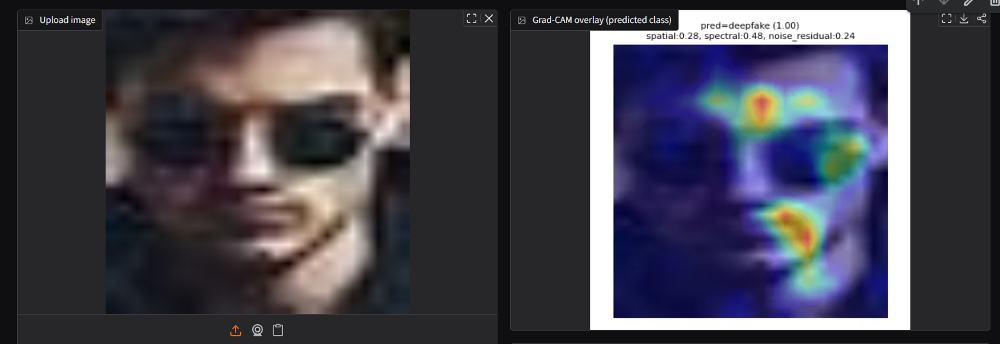
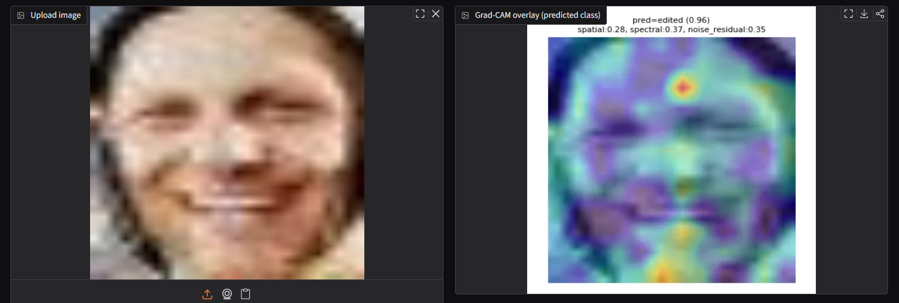
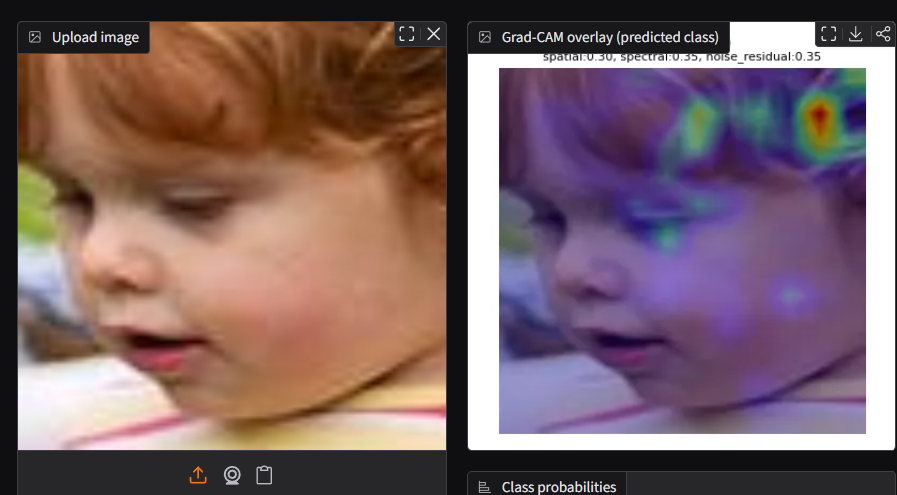

# Forgery Classifier: Real / Edited / Deepfake

3-class image classifier distinguishing **real** photos, **human-edited** images (Photoshop/splicing/retouching), and **AI-generated deepfakes** (diffusion output), with per-class explainability signals rather than a single opaque logit.

Trained and evaluated end-to-end on Colab (A100). **Validation macro-F1: 0.9079** in-distribution — and it fails on generators it wasn't trained on. Both halves of that sentence matter; this README covers both.

---

## Current status

| | |
|---|---|
| **Built and working** | 3-branch fusion model (EfficientNet-B4 spatial + FFT spectral + SRM noise-residual → gated fusion). Full data → train → eval → demo pipeline. |
| **Measured** | macro-F1 0.9079 in-distribution. Confident misclassification of Gemini / gpt-image-1 images as `real` (>75%). Three investigations ruling out a resolution/blur shortcut as the cause. |
| **Established since** | The cross-generator failure is *not* a resampling artifact. Single-generator training data is the leading cause. The `edited` class carries an unmitigated corpus fingerprint. |
| **Next** | Frozen foundation-model features + linear probe as an additional generalization path — [`docs/decisions/0002`](docs/decisions/0002-frozen-backbone-generalization.md), conditional on the gating experiment in its §9. |

**Start with [`docs/README.md`](docs/README.md)** for the full doc index and reading order.

---

## Results

Validation set, best checkpoint (early-stopped on macro-F1):

**Macro-F1: 0.9079**

| class | precision | recall | ROC-AUC (OvR) |
|---|---|---|---|
| real | 0.848 | 0.921 | 0.962 |
| edited | 0.942 | 0.895 | 0.990 |
| deepfake | 0.949 | 0.898 | 0.976 |

Confusion matrix (rows = true, cols = pred):

| true \ pred | real | edited | deepfake |
|---|---|---|---|
| **real** | 268 | 8 | 15 |
| **edited** | 17 | 145 | 0 |
| **deepfake** | 31 | 1 | 281 |

**Why these metrics:** macro-F1 (not accuracy) is the early-stopping criterion and headline number because `edited` is the smallest class after face-filtering — accuracy would let the model coast on the two larger classes while ignoring `edited`. Per-class precision/recall catches a collapsing class before the confusion matrix would. Per-class one-vs-rest ROC-AUC gives a threshold-independent view. All three come from `docs/reference/model_code.md`'s eval spec, not picked post-hoc.

### Reading the confusion matrix honestly

The obvious reading is that `edited↔deepfake` confusion is effectively absent (0 and 1) — the novel failure mode this 3-class setup introduces over a binary split, apparently solved.

That reading is incomplete. The errors track **provenance**, not just manipulation type:

| pair | shares a source dataset? | errors |
|---|---|---|
| real ↔ deepfake | yes — both COCO_AI | 46 |
| edited ↔ real | no | 25 |
| edited ↔ deepfake | no | 1 |

`edited` also posts the **highest ROC-AUC of any class (0.990)** despite being the smallest after face-filtering. `real` and `deepfake` are paired 1:1 from the same COCO_AI rows precisely so the model can't shortcut on dataset fingerprint — but **that protection never extended to `edited`**, which comes from CASIA: a different corpus with different cameras, JPEG histories, and native resolutions. Nothing in the pipeline removes those; `model/dataset.py` applies zero augmentation.

This is not proof the fingerprint was learned — a genuinely distinctive splice signature would look similar. It does mean the near-zero `edited↔deepfake` confusion **cannot be claimed as architectural success without a control**. See [`0002` §6.4](docs/decisions/0002-frozen-backbone-generalization.md) for the analysis and the cheap test that would settle it.

---

## Known limitation: cross-generator generalization

The model is validated on its training distribution (COCO_AI/SynthBuster DALL-E 3 slice) and **does not generalize to other generators**. Gemini and gpt-image-1 images, tested ad hoc after training, are confidently misclassified as `real` (>75% real score).

Scope of that claim: it was a spot check, with no recorded sample size and no fixed image set. It establishes *that* a gap exists — the direction and confidence are unambiguous — but does not quantify it. Building a reproducible OOD eval set is open work ([`0002` §11](docs/decisions/0002-frozen-backbone-generalization.md)).

**What was ruled out as the cause.** The leading hypothesis was a resampling shortcut: MTCNN bilinear-upscales small face boxes ~8-12x, so every image in every class is heavily blurred. Three investigations tested it:

| Investigation | Result |
|---|---|
| [2026-07-26-upscale-artifact](docs/investigations/2026-07-26-upscale-artifact.md) | All three classes land in the same upscale range (n=200: real 8.18x, deepfake 8.59x, edited 12.43x) — no clean per-class blur-magnitude confound. |
| [2026-07-27-fft-srm-template-swap](docs/investigations/2026-07-27-fft-srm-template-swap-probe.md) | Rules out a targeted per-class shortcut in the averaged fft/srm channels. Records its own scope gap: never varies `rgb`. |
| [2026-07-27-resolution-swap](docs/investigations/2026-07-27-resolution-swap-probe.md) | Varies `rgb` directly. Rules out a general resolution-magnitude shortcut across 2 of 3 achievable pairs, replicated across a >30% swing in perturbation size. One small residual (`real→edited`) left open. |

**So the blur is not the story.** The leading remaining cause is training on exactly one generator (DALL-E 3), at one resolution regime. A likely mechanism: DALL-E 3 is latent-diffusion, so the FFT and SRM branches learned VAE-upsampling traces — and gpt-image-1, being autoregressive/token-based, doesn't carry them. That mechanism is a hypothesis, not a measurement.

Whether the fix is purely more data, or whether the architecture itself doesn't transfer, is the open question [`0002`](docs/decisions/0002-frozen-backbone-generalization.md) is built to answer. It argues the fully-fine-tuned design is *itself* part of the problem, and proposes a frozen-backbone path to test against it.

---

## Architecture

3-branch fusion model feeding a gated classifier head:

```
RGB image (~380x380)
   |-- EfficientNet-B4 (full fine-tune)        --> spatial embedding
   |-- FFT-magnitude (log-scaled)  -> small CNN --> spectral embedding
   |-- SRM high-pass residual      -> small CNN --> noise-residual embedding
                                          |
                          concat -> gating/attention MLP
                                          |
                  +------------------------+------------------------+
             3-way softmax                          per-branch contribution weights
        (real / edited / deepfake)                 (spatial / spectral / noise-residual
                                                      -- the explainability signal)
```

Grad-CAM on the spatial branch adds a visual "where" heatmap alongside the gate's "which evidence type" weighting.

**Key decisions** (full reasoning and discarded alternatives in [`docs/decisions/0001`](docs/decisions/0001-architecture-decisions.md)):

- **EfficientNet-B4 over Xception.** Both are spatial-texture backbones — running both would be two opinions on one signal rather than diverse evidence. EfficientNet-B4 picked for parameter efficiency (~19M vs ~22.9M params, 82.6–83% vs 79.0% ImageNet top-1). Note the honest caveat: a controlled benchmark (DeepfakeBench) found the two perform about the same on forgery detection, so this is a parameter-efficiency choice, not a proven accuracy or speed edge.
- **Why 3 branches, not 1, 2, or 4+.** 1 branch is a single opaque logit — fails the explainability requirement and risks learning dataset fingerprints. 2 branches (spatial + spectral) leaves `edited` with no branch built for its failure mode: a splice doesn't disturb global frequency statistics much, so it needs noise-residual. 4+ has diminishing returns and makes the gate harder to read. 3 branches map onto 3 manipulation types — structural, generative-frequency, boundary-splice.

---

## Dataset

One dataset per class (see [`0001` → Dataset](docs/decisions/0001-architecture-decisions.md)):

| Class | Source |
|---|---|
| Real | Pristine images paired 1:1 with the DALL-E 3 slice below |
| Edited | CASIA v2.0 tampered set |
| Deepfake | DALL-E 3 slice of COCO_AI/SynthBuster |

All three classes are face-detected and cropped uniformly (MTCNN via `facenet_pytorch`) — see [`docs/reference/data_download.md`](docs/reference/data_download.md).

**Real and deepfake are paired 1:1 from the same COCO_AI rows** (`coco_image` / `dalle_image` per row) rather than sourced from two unrelated datasets — deliberate, so the model can't shortcut on dataset fingerprint instead of manipulation cues.

**The gap in that design:** the pairing covers `real` and `deepfake` only. `edited` comes from a foreign corpus with no provenance matching, which is the caveat under [Reading the confusion matrix](#reading-the-confusion-matrix-honestly). The root cause is that **no public dataset supplies all three classes from a common distribution** — which is why `0002` defers `edited` rather than solving it.

**Dataset iteration:** started at 1,000 COCO_AI pairs, raised to 3,000-5,000 after an early diagnostic showed most of raw COCO has no person/face in frame (not a detector problem) — `data/download.py` pre-filters on caption wording, and `data/face_filter.py` enforces a 300-image survival floor per class after MTCNN filtering.

---

## Explainability

**Gate contribution weights** — per-branch share of the fused prediction, paired with Grad-CAM for "where" + "which evidence type":

| | spatial | spectral | noise_residual |
|---|---|---|---|
| overall | 0.287 | 0.414 | 0.298 |
| real | 0.294 | 0.365 | 0.342 |
| edited | 0.270 | 0.367 | 0.363 |
| deepfake | 0.291 | 0.485 | 0.225 |

This matches the architecture's stated intent: spectral carries the most weight for `deepfake` (0.485) — the diffusion-artifact spectral-falloff signal it was designed to catch — while `edited` leans relatively more on noise-residual (0.363) than `deepfake` does (0.225), consistent with splice-boundary discontinuity vs. single-generation-process uniformity.

**Two caveats:**

1. **Gate weight is contribution, not accuracy.** It says how much each embedding influenced the fused decision, not how well each branch would classify alone. A missed addition (noted in `notes.md`) was a small auxiliary classifier head per branch, evaluated before the merge, which would give each stream's standalone F1. That needs an architecture change and retraining, so treat these numbers as directional.
2. **The weights don't disambiguate signal from fingerprint.** `edited` leaning on noise-residual is consistent with a splice-boundary tell — and equally consistent with CASIA's sensor/compression fingerprint, which loads on the same branch.

### Demo screenshots

Three live-demo runs on held-out val images, all heavily blurred (a property of the training distribution). The model calls all three correctly:

| True class | Model prediction | Gate weights (spatial / spectral / noise) |
|---|---|---|
| `deepfake` | **deepfake, 1.00** | 0.28 / 0.48 / 0.24 |
| `edited` | **edited, 0.96** | 0.28 / 0.37 / 0.35 |
| `real` | **real** | 0.30 / 0.35 / 0.35 |

<table>
<tr><td align="center"><b>deepfake</b><br></td></tr>
<tr><td align="center"><b>edited</b><br></td></tr>
<tr><td align="center"><b>real</b><br></td></tr>
</table>

These show the model separating classes on images too blurry for a human to judge by eye. On their own, three hand-picked images are an illustration, not evidence — the actual support for "it isn't just reading sharpness" comes from the [counterfactual probes](#known-limitation-cross-generator-generalization), which tested it directly and at scale.

---

## Live demo

`model/demo.py` — Gradio app: upload any image, it auto-detects+crops the face (same MTCNN settings as training), runs the 3-branch model, and shows class probabilities, gate weights, and a Grad-CAM overlay.

```
python model/demo.py --checkpoint checkpoints/best_model.pt --share
```

Or from the notebook's "Demo" section, which launches with `share=True` for a public `*.gradio.live` link (valid ~72h, live only while the Colab session stays connected).

---

## Environment

```
.venv\Scripts\activate   # Windows
pip install -r requirements.txt
```

CUDA is used automatically when available (`DEVICE` in `config.py`). **GPU used:** 1x NVIDIA A100 (40GB VRAM), Google Colab Pro. Peak VRAM during training ~30-33GB at `batch_size=64, lr=3e-4, weight_decay=1e-4, num_workers=4`.

---

## Repo layout

| Path | Contents |
|---|---|
| `config.py` | Shared paths/constants for data and model code |
| `data/download.py`, `data/face_filter.py` | Dataset download + face-detect/crop pipeline |
| `model/branches.py`, `model/fusion.py`, `model/dataset.py`, `model/train.py`, `model/eval.py` | Model, training, and eval code |
| `model/counterfactual_probe.py`, `model/resolution_swap_probe.py` | Shortcut-hypothesis probes behind the investigations |
| `model/demo.py` | Standalone Gradio demo |
| `forgery_classifier.ipynb` | Colab notebook driving Data/Train/Eval end to end |
| `docs/` | Decisions, reference, research, investigations — index at [`docs/README.md`](docs/README.md) |

---

## Time spent

Initial build session (4 hours):

| Window | Activity |
|---|---|
| 2:00 – 2:30 PM | Setup, understanding the problem statement |
| 2:30 – 3:00 PM | Domain research, SOTA approaches |
| 3:00 – 4:00 PM | Architecture decisions |
| 4:00 – 4:30 PM | Scaffolding code files |
| 4:30 – 5:00 PM | Squashing dependency and code bugs |
| 5:00 – 6:00 PM | Downloading + processing data — halted on the deepfake class: only 197 faces survived MTCNN filtering against a 300 floor. Training did not start within this session. |

Work after that session: cleared the survival floor on a later data pass, ran training and eval to completion (the [Results](#results) above), built the demo, then ran the three shortcut investigations and wrote [`0002`](docs/decisions/0002-frozen-backbone-generalization.md).

---

## Future work

**Data — the bottleneck, ahead of anything architectural.**

- **Train on multiple generators.** Currently DALL-E 3 only, which is the leading cause of the cross-generator failure. FLUX.2-dev and SDXL are open-weight and runnable on the existing A100 at no marginal cost; hold out GPT Image 2, Nano Banana Pro, and Midjourney V8.1 as eval-only to measure the gap directly. (Not Imagen 4 — deprecated, shuts down 2026-08-17.)
- **Source face-centric, higher-resolution imagery.** The current sources are full-scene, non-portrait framing, so the detected face is a small fraction of the frame and gets bilinear-upscaled ~8-12x to reach 380px. Higher native resolution alone doesn't fix this — the acceptance criterion is that the face already fills the frame, so the pipeline downsamples rather than upsamples.
- **Fix the `edited` provenance gap.** Either root all three classes in a common base image pool, or hold out a second edited corpus to measure the fingerprint rather than assume it away.
- **Fix the deepfake-class shortfall properly** — a larger and/or face-specific diffusion source, rather than a general-purpose slice that loses its hardest (most malformed, most informative) examples to MTCNN's landmark filter.
- Add face-swap/reenactment coverage (FaceForensics++, Celeb-DF) if the threat model includes GAN-based face swaps, not just full-image diffusion. Deliberately dropped for v1.

**Model**

- **Frozen foundation-model features + linear probe** as the generalization path — the current active decision, [`0002`](docs/decisions/0002-frozen-backbone-generalization.md).
- **Training augmentation** — currently zero. Gaussian blur σ ∈ [0,2] and JPEG quality ∈ {60,70,80,90,100} is the standard protocol, and it's a prerequisite for robustness on both paths.
- **Per-branch auxiliary classifier heads** evaluated before fusion, giving each stream a standalone F1 instead of only a contribution weight. Requires retraining.
- Revisit EfficientNet-B4 vs. a ViT spatial backbone given more than one session to tune it.

**Pipeline breadth**

- Metadata forensics as a cheap first-pass filter — EXIF, C2PA provenance manifests, SynthID watermarks, dimensions, compression. All trivially strippable, so useless as a primary defense, but free to check and a positive hit is near-certain evidence.
- Post-training design: what breaks against real KYC traffic — adversarial recompression/cropping to evade the noise-residual branch, unseen generators, drift in what "edited" looks like.

---

## Notes

- `edited` means human-edited (Photoshop, splicing, filtering); AI-based editing is classified as `deepfake`.
- Open to-dos and working notes live in [`notes.md`](notes.md).
