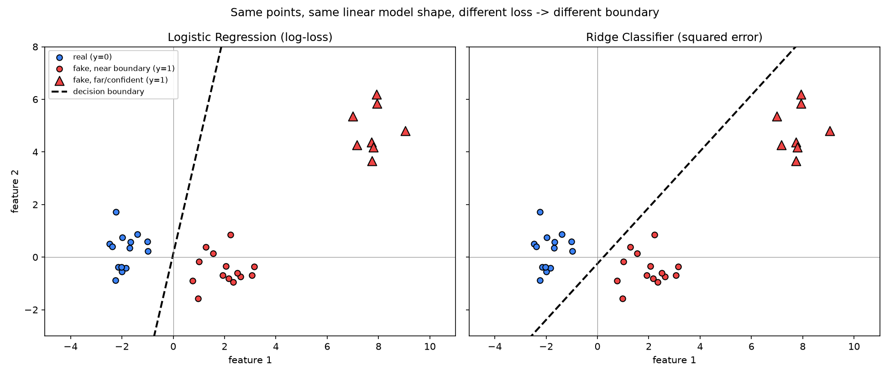

# Logistic Regression vs. Ridge as linear probes

Background note, not a project finding. Written while reading arXiv:2606.26384 ("What Do
Deepfake Benchmarks Measure? An Audit Using Frozen Self-Supervised Representations"), which
fits both an L2-regularized Logistic Regression probe and an L2-regularized Ridge classifier
probe at every layer of a frozen backbone (DINOv3 ViT-L for images). Relevant to `0002`'s
§9 gating experiment, which plans the same frozen-embedding + linear-probe setup.

The paper states *that* it uses both probes (§3.2) but never states *why*. This note is the
general ML reasoning for why you'd do that, worked out concretely rather than left abstract.

## The two losses

- **Logistic regression** fits $p = \sigma(w^Tx)$ and minimizes log-loss. It only cares about
  which side of the decision boundary a point falls on and how confidently — once a point is
  correctly and confidently classified, its gradient contribution shrinks to ~0.
- **Ridge classifier** fits a raw score $w^Tx$ against numeric targets ($y \in \{-1,+1\}$) and
  minimizes squared error. It keeps penalizing any point whose score isn't *exactly* the
  target, even points that are already unambiguously correctly classified — "overshoot" past
  the target still costs loss.

## Why this matters for a layer-sweep probe

Two linear classifiers with different loss functions are a way to check whether a finding
("this layer's frozen features linearly separate real from fake") reflects the representation
itself, or an artifact of one particular classifier's loss shape. Concretely, Ridge is also
much cheaper to fit (closed-form solve vs. iterative optimization), which matters when sweeping
every layer of a large backbone.

## Concrete demo: same data, different boundary

`loss_boundary_demo.py` fits both classifiers on the same synthetic 2-class 2D dataset: two
well-separated core clusters, plus a cluster of "fake" points that are far from the boundary
but still correctly on the fake side (i.e., already easy/confident, not ambiguous).

Logistic regression's boundary sits almost vertically between the two near clusters and
ignores the far cluster — those points are already confidently classified, so their gradient
contribution is negligible. Ridge's boundary visibly **rotates** toward the far cluster: it
keeps paying a squared-error cost for every far point not landing exactly on $+1$, and reduces
that cost by tilting the whole hyperplane, at the expense of margin against the near cluster.
Both still get 0/36 misclassified on this particular sample, but Ridge's rotated boundary
leaves much less margin — a new point in the region between the two near clusters is more
likely to be misclassified by the Ridge boundary than by logistic regression's.

Run it directly: `python loss_boundary_demo.py` (needs `scikit-learn`, `matplotlib`, already
in `requirements.txt`). Regenerates `loss_boundary_demo.png` in this folder.
